# 📊 Vendor Performance & Supply Chain Efficiency Analysis

An **end-to-end data analytics project** analyzing vendor profitability, procurement efficiency, and inventory performance using **SQL, Python, and Power BI**.

This project simulates a **real-world supply chain analytics scenario** where a company evaluates vendor performance to improve procurement strategy, reduce inventory inefficiencies, and increase profitability.

---

 # 📊 Power BI Dashboard

  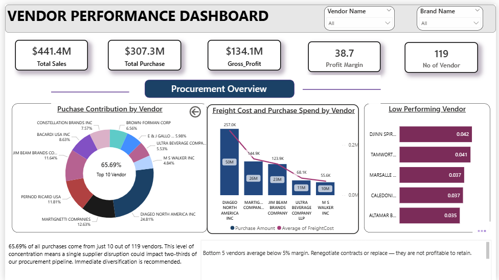

  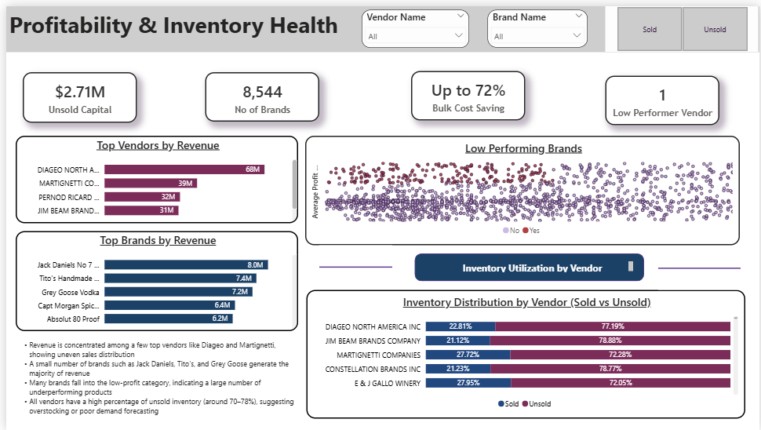

The interactive dashboard tracks key KPIs including:

- Vendor Profit Contribution
- Profit Margin
- Inventory Turnover
- Procurement Cost Distribution
- Vendor Purchase Contribution

---

# 🧠 Business Context

Organizations working with multiple vendors must continuously evaluate supplier performance to ensure:

- Efficient procurement
- High profitability
- Optimal inventory turnover
- Reduced supply chain risk

However, large transactional datasets across purchasing and sales systems make it difficult to quickly identify performance issues.

This project builds a **data-driven vendor analytics framework** to support better procurement, pricing, and inventory decisions.

---

# 🎯 Business Impact

The analysis revealed several important insights:

### 1. Vendor Concentration Risk

The **top 10 vendors contribute nearly 66% of total purchases**, creating dependency on a small group of suppliers and increasing supply chain risk.

### 2. Unsold Inventory

The analysis identified approximately **$2.7 million worth of unsold inventory**, indicating inefficient inventory turnover and capital tied up in stock.

### 3. Bulk Purchasing Efficiency

Bulk purchasing analysis showed that high-volume procurement can lead to **up to 72% reduction in per-unit cost**, demonstrating strong cost advantages when purchasing at scale.

---

# 🛠 Tech Stack

### Data Processing
- SQL
- SQLite
### Data Analysis
- Python
- Pandas
- NumPy
### Data Visualization
- Matplotlib
- Seaborn
- Power BI
### Statistical Analysis
- SciPy
### Development Environment
- Jupyter Notebook
- VS Code

---

# ⚙️ Data Pipeline & Workflow

## Data Ingestion

A Python pipeline was built to ingest and structure raw datasets.

Script used:

`ingestion.py`

The script:

- Reads dataset tables
- Connects Python with **SQLite3**
- Loads data into a relational database called:

`inventory.db`

---

## Dataset Tables

The dataset contains multiple relational tables representing purchasing and sales processes.

Tables included in the dataset:

- begin_inventory
- end_inventory
- purchases
- purchase_price
- vendor_invoice
- sales

For the final analysis, the following tables were used:

- purchases
- purchase_price
- vendor_invoice
- sales

The inventory tables were not required for the analytical model.

---

## Data Integration

A consolidated analytical dataset called:

`vendor_sales_summary`

was created by combining purchasing, pricing, invoice, and sales data.

The dataset contains key metrics such as:

- Vendor Information
- Total Purchase Value
- Total Sales Revenue
- Vendor Profit
- Profit Margin
- Inventory Turnover
- Procurement Cost

---

## Query Optimization

The **sales table contains more than 10 million records**, making queries computationally expensive.

To improve performance:

- SQL **Common Table Expressions (CTEs)** were used
- Large tables were pre-aggregated before joins

This reduced query execution time and improved scalability.

---

## Data Cleaning

Before analysis, the dataset was validated by:

- Handling missing values
- Removing inconsistencies
- Standardizing vendor and brand information
- Validating financial metrics

---

## Data Export

The final dataset `vendor_sales_summary` was stored in:

- SQLite database → `inventory.db`
- CSV file → `vendor_sales_summary.csv`

This allowed seamless integration with **Python analysis and Power BI dashboards.**

---

# 📊 Analytical Questions Solved

This project answers key business questions:

### 1. Which brands show low sales but high profit margins, indicating a need for promotional pricing?

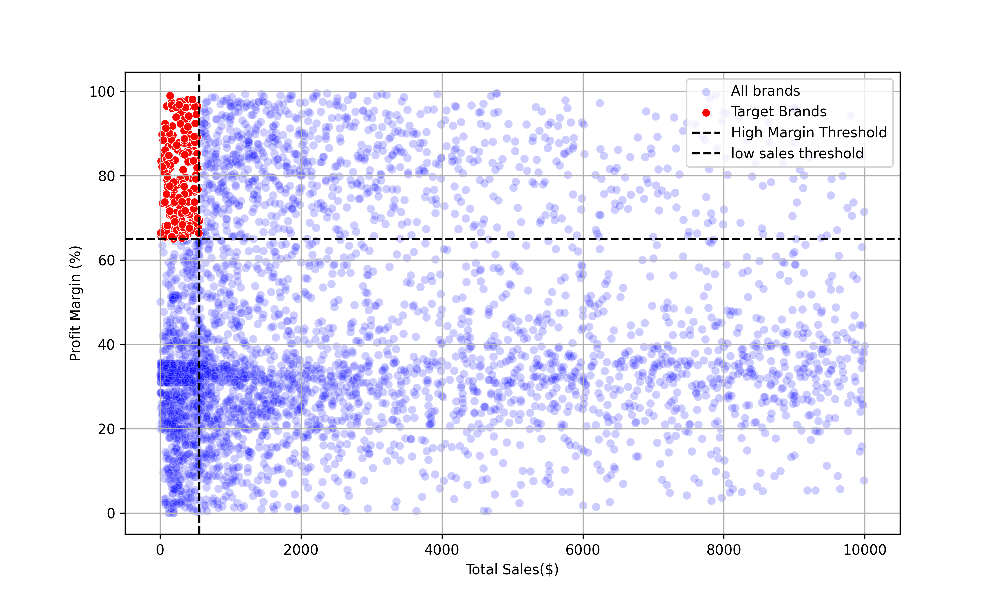

### 2. Which vendors and brands generate the highest sales performance?

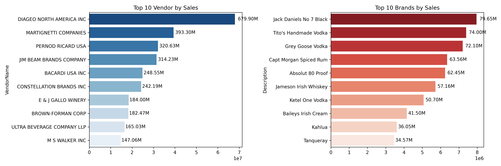

### 3. Which vendors contribute the largest share of purchase orders?

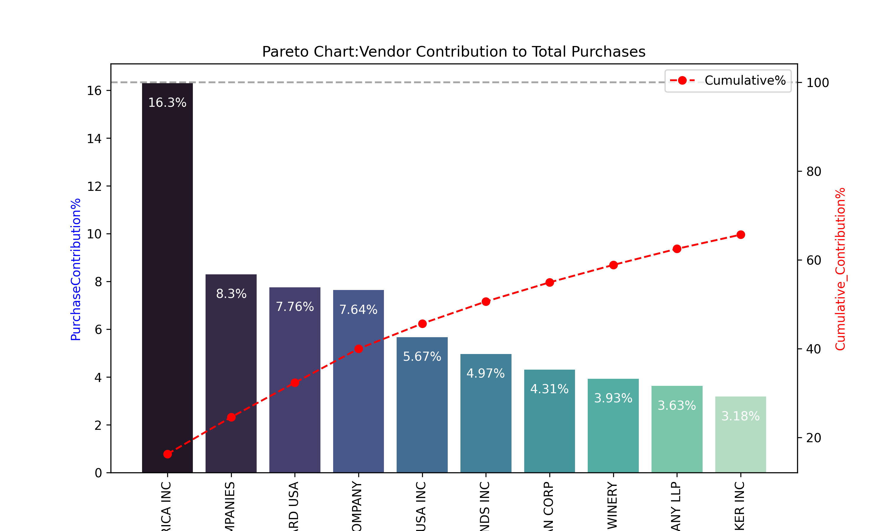

### 4. How dependent is procurement on top vendors?

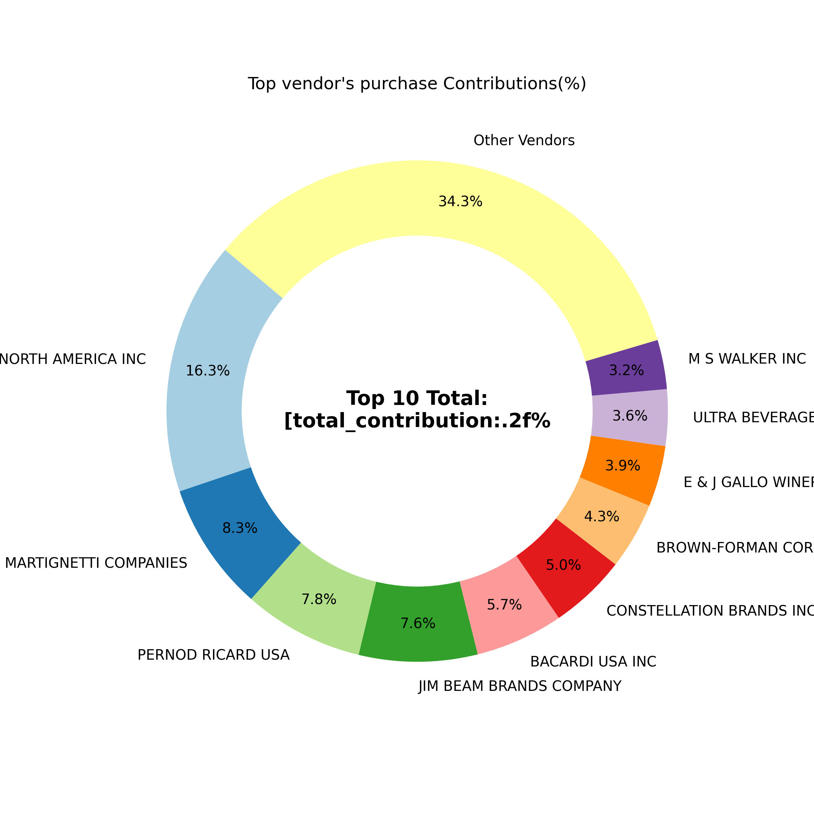

### 5. Does bulk purchasing reduce unit cost, and what is the optimal purchase volume?

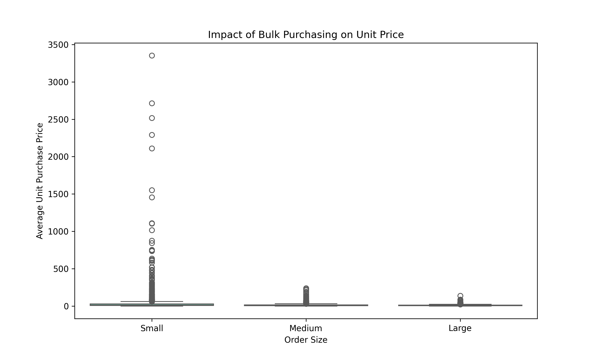

### 6. Which vendors have low inventory turnover, indicating slow-moving products?

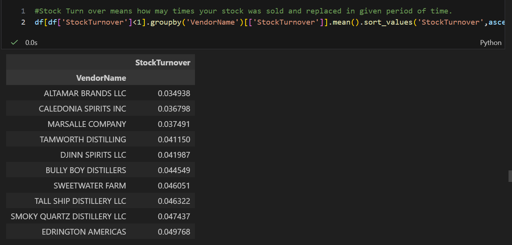

### 7. How much capital is locked in unsold inventory per vendor?

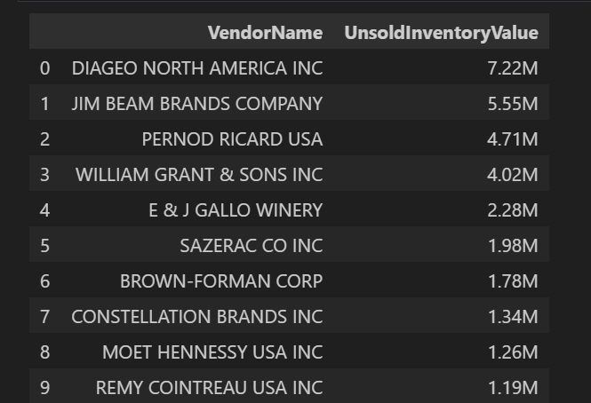

### 8. Is there a statistically significant difference in profit margins between top and low-performing vendors?

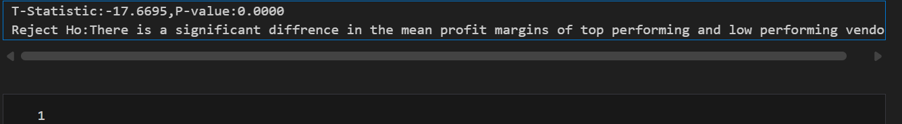

---

 # 📊 Exploratory Data Analysis

The analysis was performed using **Python (Pandas, NumPy)** and visualized with **Matplotlib and Seaborn**.

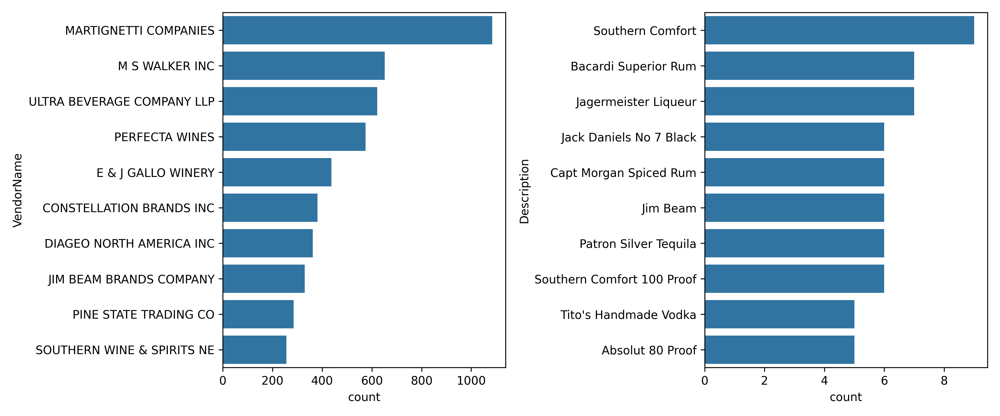

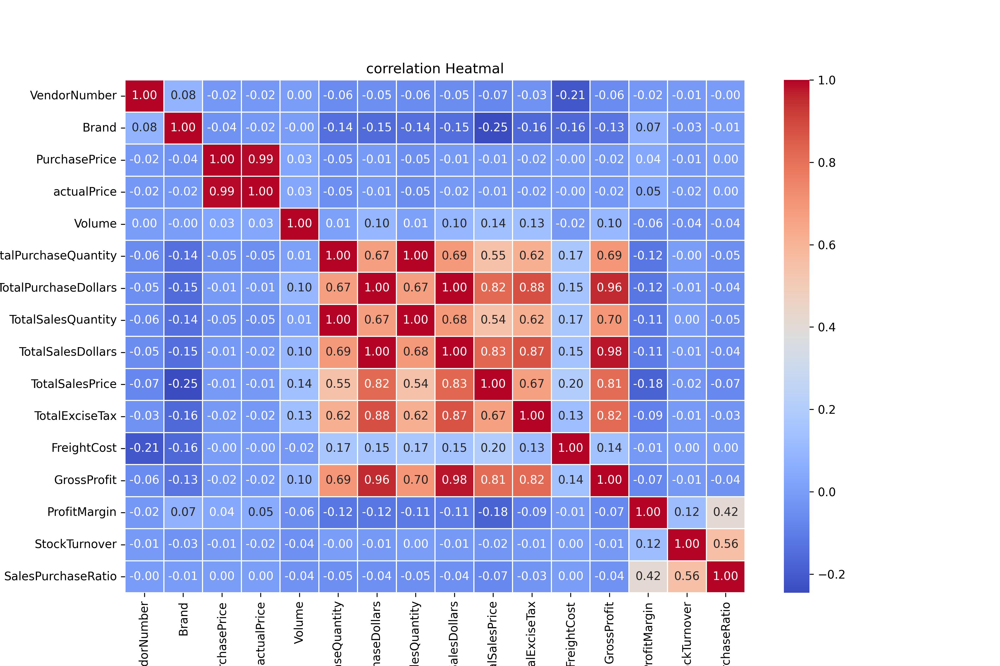

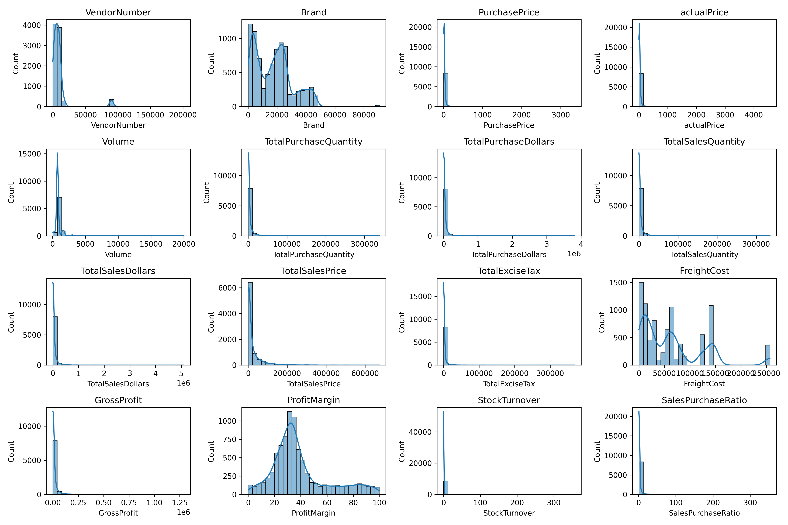

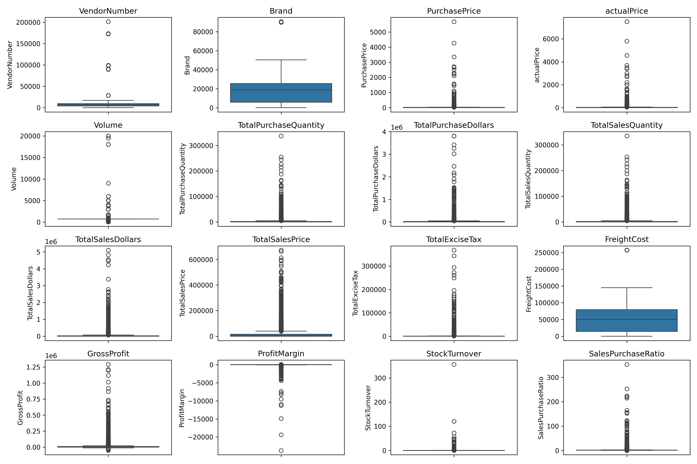

These visualizations reveal patterns in:

- Vendor profitability
- Inventory turnover
- Sales vs purchase performance
- Bulk purchasing efficiency

---

# 🚀 Business Recommendations

### -  Vendor Diversification
Since **66% of procurement depends on only 10 vendors**, companies should diversify suppliers to reduce supply chain risk.

### -  Inventory Optimization
The presence of **$2.7M in unsold inventory** suggests the need for improved inventory monitoring and demand forecasting.

### - Pricing Strategy
Brands with **high margins but low sales performance** should be evaluated for promotional pricing strategies.

### -  Demand-Driven Procurement
Bulk purchasing should be aligned with **actual demand** to balance cost savings and inventory efficiency.

---

# 👩‍💻 Author

**Mahak Bisht**  
Aspiring **Data Analyst / Business Analyst**

**Skills**

- SQL  
- Python  
- Power BI  
- Data Analytics  
- Business Intelligence  

Author 
Mahak Bisht
mail : mahak.bisht2003@gmail.com
🔗 LinkedIn  
https://www.linkedin.com/in/mahak-bisht-79241528a  
🔗 GitHub  
https://github.com/mahakb2003
